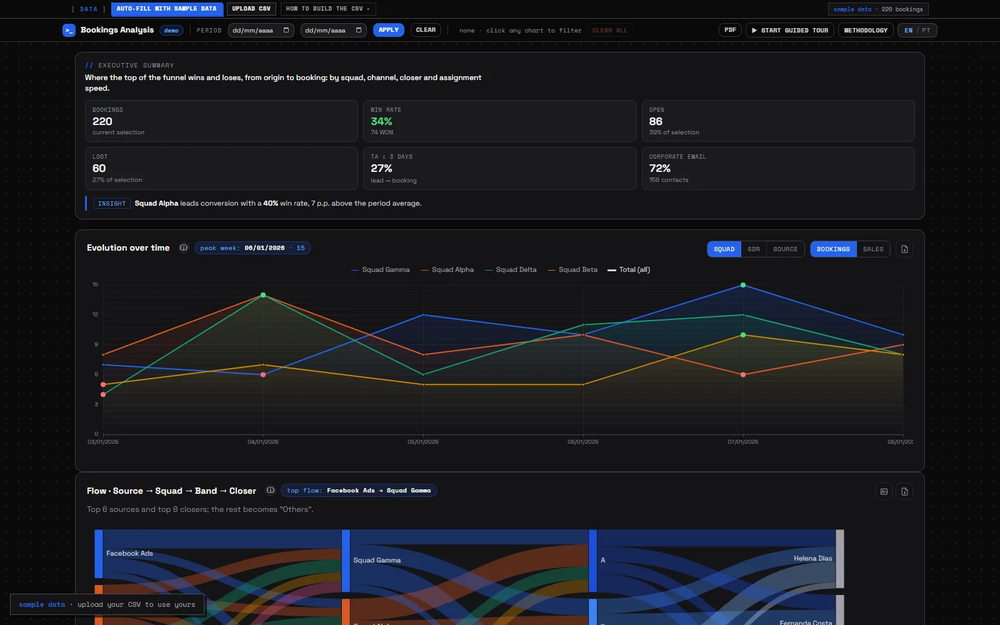
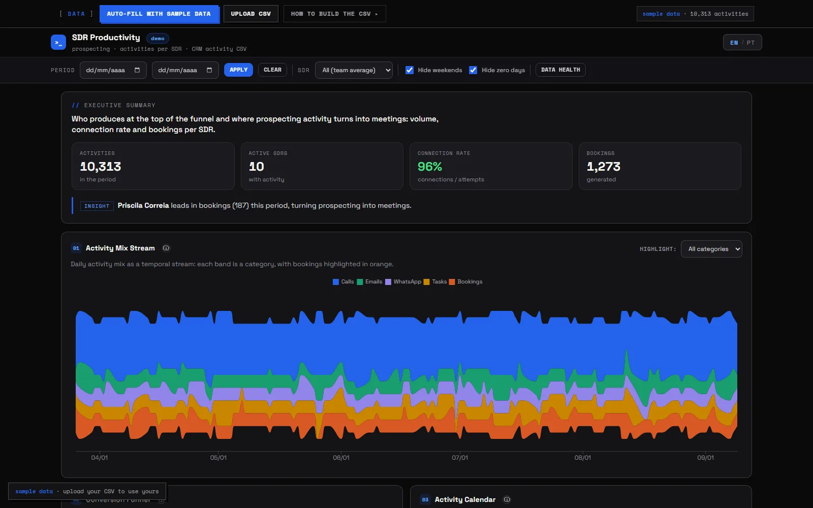
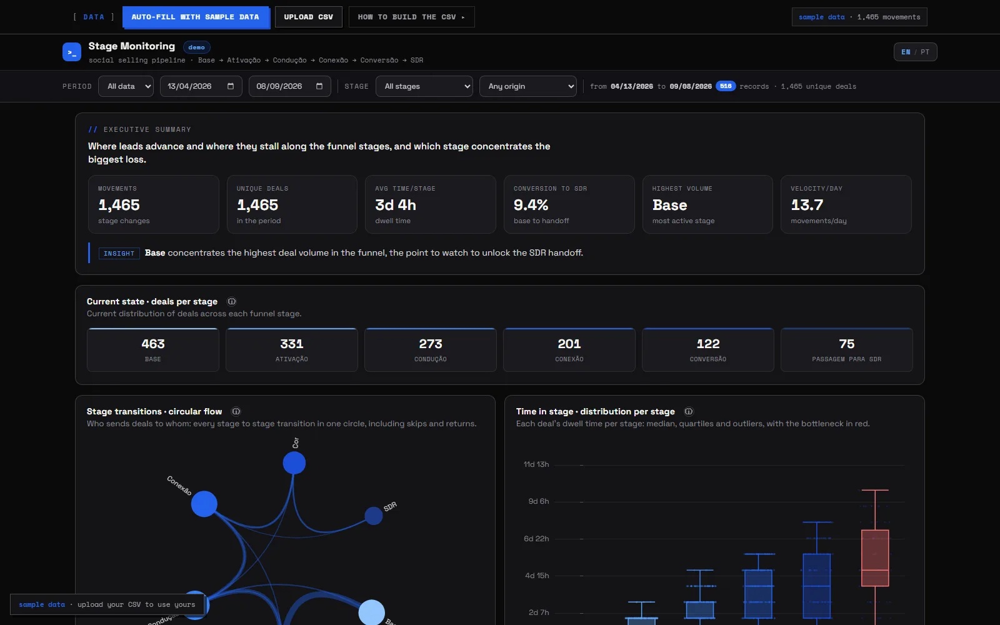
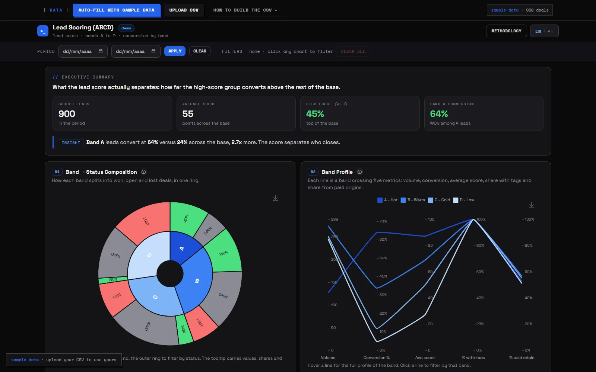
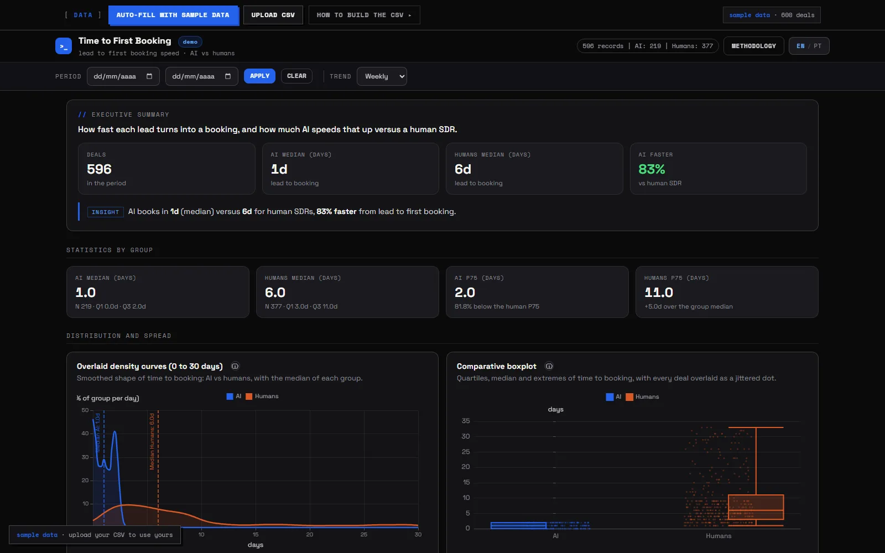
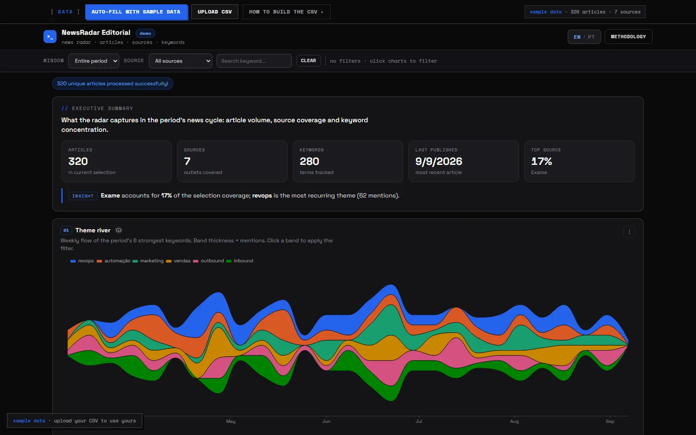
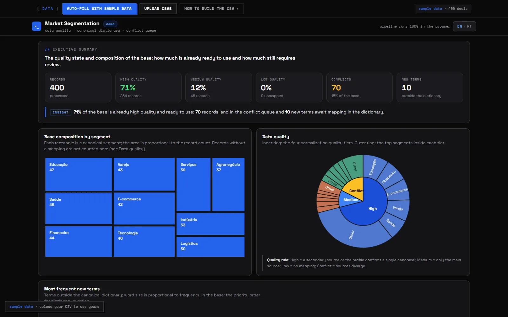
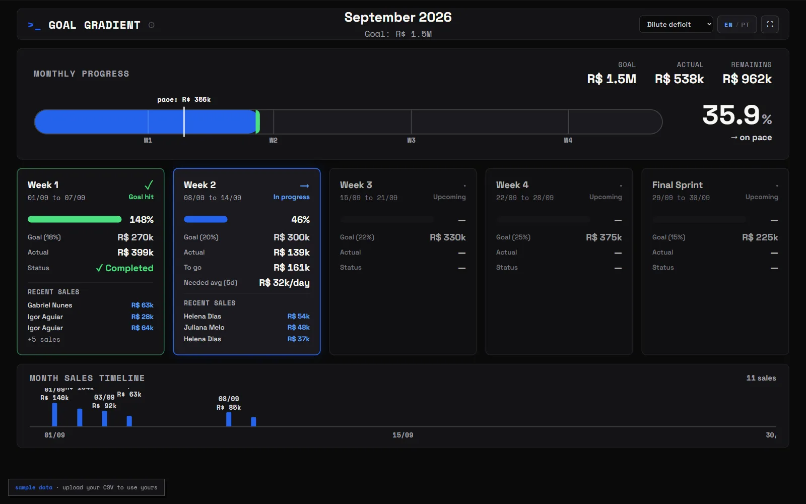

  

# Sales & Marketing Analytics Dashboards

**Live demo: [felippeyann.github.io/sales-analytics-dashboards](https://felippeyann.github.io/sales-analytics-dashboards/)**

Eight interactive analytics dashboards built for the revenue operation of a B2B SaaS company (CRM platform). They ran in production on office TVs and in the browser, used daily by SDR teams, sales managers and marketing.

Everything here is a **demo build**: all data is 100% synthetic (people, emails, deals and metrics were replaced or generated) and the company is anonymized. Each dashboard ships with embedded sample data, so it renders immediately. No install, no backend, no build step.

## Dashboards

Click any preview to open the live dashboard.

<table>
  <tr>
    <td width="50%">
      
      <b>01 · Análise de Agendamentos</b> 
      Meeting-booking funnel: UTM origin Sankey, squad comparison, time-to-assignment, cross filters, AI insights
    </td>
    <td width="50%">
      
      <b>02 · Produtividade SDR</b> 
      Daily SDR productivity: calls, connections, bookings, individual ranking vs team average, configurable goals
    </td>
  </tr>
  <tr>
    <td width="50%">
      
      <b>03 · Stage Monitoring</b> 
      Social-selling pipeline stage changes: flow Sankey, average time per stage, bottleneck detection
    </td>
    <td width="50%">
      
      <b>04 · Lead Scoring</b> 
      Lead classification (A/B/C/D) and conversion rates by score band
    </td>
  </tr>
  <tr>
    <td width="50%">
      
      <b>05 · Primeiro Agendamento</b> 
      AI vs human SDR benchmark: response time to first meeting
    </td>
    <td width="50%">
      
      <b>06 · NewsRadar Editorial</b> 
      Editorial analytics: keyword explorer (word cloud, network, heatmap), theme evolution, sources
    </td>
  </tr>
  <tr>
    <td width="50%">
      
      <b>07 · Segmentação</b> 
      Customer and lead segmentation analysis
    </td>
    <td width="50%">
      
      <b>08 · Gradiente de Metas</b> 
      Goal-gradient tracking against sales targets
    </td>
  </tr>
</table>

## Tech

- Vanilla JavaScript, one self-contained HTML file per dashboard (no framework, no bundler)
- [Apache ECharts 6](https://echarts.apache.org/) for visualizations: Sankey, heatmaps, word clouds, multi-axis series
- Client-side CSV upload (PapaParse) for loading your own data; nothing leaves the browser
- Optional AI-generated insights via Gemini (you provide your own API key in the UI)
- UI language: Portuguese (pt-BR)

## Notes

These dashboards were designed for real operational use: cross-filtering, PNG/PDF/CSV export, TV-friendly scaling and per-user goal configuration came from day-to-day demands of a sales floor, not from a tutorial.

Author: [Felippe Yann](https://github.com/felippeyann)
